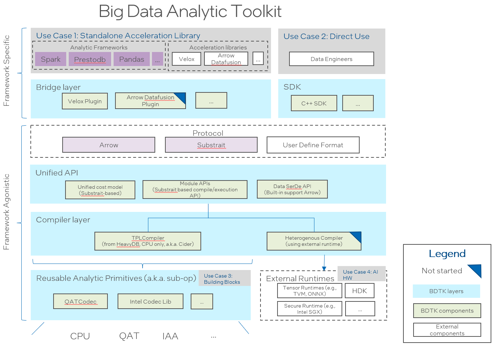

<!---
  Licensed to the Apache Software Foundation (ASF) under one
  or more contributor license agreements.  See the NOTICE file
  distributed with this work for additional information
  regarding copyright ownership.  The ASF licenses this file
  to you under the Apache License, Version 2.0 (the
  "License"); you may not use this file except in compliance
  with the License.  You may obtain a copy of the License at

    http://www.apache.org/licenses/LICENSE-2.0

  Unless required by applicable law or agreed to in writing,
  software distributed under the License is distributed on an
  "AS IS" BASIS, WITHOUT WARRANTIES OR CONDITIONS OF ANY
  KIND, either express or implied.  See the License for the
  specific language governing permissions and limitations
  under the License.
-->

# Introduction

Big Data Analytic Toolkit is a set of acceleration libraries aimed to optimize big data analytic frameworks.

The following diagram shows the design architecture.



Major components of the project include:

 - [Cider](https://github.com/intel/BDTK/tree/main/cider):

   a modularized and general-purposed Just-In-Time (JIT) compiler for data analytic query engine. It employs  [Substrait](https://github.com/substrait-io/substrait) as a protocol allowing to support multiple front-end engines. Currently it provides a LLVM based implementation based on [HeavyDB](https://github.com/heavyai/heavydb).

 - [Velox Plugin](https://github.com/intel/BDTK/tree/main/cider-velox):

   a Velox-plugin is a bridge to enable Big Data Analytic Toolkit onto [Velox](https://github.com/facebookincubator/velox/commits/main). It introduces hybrid execution mode for both compilation and vectorization (existed in Velox). It works as a plugin to Velox seamlessly without changing Velox code.

 - [Intel Codec Library](https://github.com/Intel-bigdata/IntelCodecLibrary):

   Intel Codec Library for BigData provides compression and decompression library for Apache Hadoop/Spark to make use of the acceleration hardware for compression/decompression.

# Cider & Velox Plugin

## Getting Started

### Get the BDTK Source
```
git clone --recursive https://github.com/intel/BDTK.git
cd BDTK
# if you are updating an existing checkout
git submodule sync --recursive
git submodule update --init --recursive
```

### Setting up BDTK develop envirenmont on Linux Docker

We provide Dockerfile to help developers setup and install BDTK dependencies.

1. Build an image from a Dockerfile
```shell
$ cd ${path_to_source_of_bdtk}/ci/docker
$ docker build -t ${image_name} .
```
2. Start a docker container for development
```shell
$ docker run -d --name ${container_name} --privileged=true -v ${path_to_source_of_bdtk}:/workspace/bdtk ${image_name} /usr/sbin/init
```
### How to build
Once you have setup the Docker build envirenment for BDTK and get the source, you can enter the BDTK container and build like:

Run `make` in the root directory to compile the sources. For development, use
`make debug` to build a non-optimized debug version, or `make release` to build
an optimized version.  Use `make test-debug` or `make test-release` to run tests.

## Major API Example

Examples of major APIs [can be found here](cider/examples)

## How to Enable in Presto

# Code Of Conduct
Big Data Analytic Toolkit's Code of Conduct [can be found here.](CODE_OF_CONDUCT.md)

# Online Documentation

You can find the all the Big Data Analytic Toolkit documents on the [project web page](https://intel.github.io/BDTK/).

# License

Big Data Analytic Toolkit is licensed under the Apache 2.0 License. A copy of the license
[can be found here.](LICENSE)

