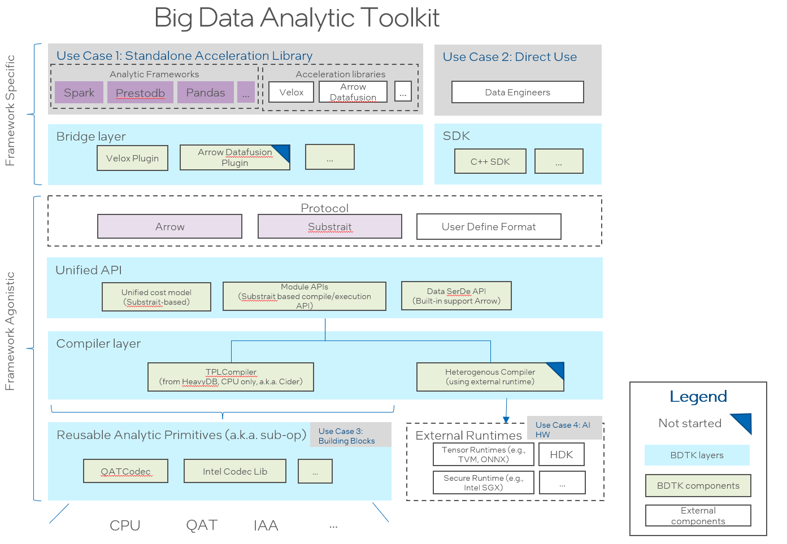

===================
Cider in 10 minutes
===================

Introduction
--------------------------------------

Big Data Analytic Toolkit is a set of acceleration libraries aimed to optimize big data analytic frameworks.

By using this library, frontend SQL engines like Prestodb/Spark query performance will be significant improved.

The following diagram shows the design architecture.

Major components of the project include:

 - `Cider <https://github.com/intel/BDTK/tree/main/cider>`__:

   a modularized and general-purposed Just-In-Time (JIT) compiler for data analytic query engine. It employs  `Substrait <https://github.com/substrait-io/substrait>`__ as a protocol allowing to support multiple front-end engines. Currently it provides a LLVM based implementation based on `HeavyDB <https://github.com/heavyai/heavydb>`__
   ).

 - `Velox Plugin <https://github.com/intel/BDTK/tree/main/cider-velox>`__:

   a Velox-plugin is a bridge to enable Big Data Analytic Toolkit onto `Velox <https://github.com/facebookincubator/velox/commits/main>`__. It introduces hybrid execution mode for both compilation and vectorization (existed in Velox). It works as a plugin to Velox seamlessly without changing Velox code.

 - `Intel Codec Library <https://github.com/Intel-bigdata/IntelCodecLibrary>`__:

   Intel Codec Library for BigData provides compression and decompression library for Apache Hadoop/Spark to make use of the acceleration hardware for compression/decompression.

APIs
--------------------------------------

The following table shows the query parameters for this service.

=================== ==================================== ========
Attribute                      Description               Required
=================== ==================================== ========
CiderRuntimeModule	   The runtime module of Cider	        Yes
=================== ==================================== ========

Runtime Module
++++++++++++++++++++++

The following attributes will be used in your development:

* ``getGroupByAggHashTableIteratorAt``

  Return the iterator pointer of the input offset.

* ``convertGroupByAggHashTableToString``

  Convert group by agg hash table to string (For test only).

* ``convertQueryMemDescToString``

  Convert query memory descriptor to string (For test only).

Code Blocks
++++++++++++++++++++++
.. code-block:: c++

  // Group-by Agg related functions
  CiderAggHashTableRowIteratorPtr getGroupByAggHashTableIteratorAt(size_t index);
  const std::string convertGroupByAggHashTableToString() const;  // For test only
  const std::string convertQueryMemDescToString() const;         // For test only
  size_t getGroupByAggHashTableBufferNum() const;
  bool isGroupBy() const;
