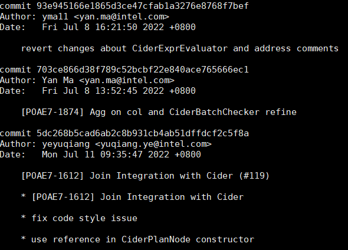
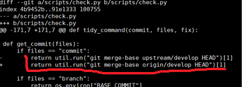

Developer Guide
===============

1 How to build
--------------

1.1 Build Modular SQL
~~~~~~~~~~~~~~~~~~~~~

| **Prerequisite:**
| Install docker and set proxy according to the guidance in:
| https://docs.docker.com/config/daemon/systemd/
| https://docs.docker.com/network/proxy/

1. Clone repo locally

::

   # WORKDIR: ${workdir}
   # omnisci
   git clone https://github.com/intel-innersource/frameworks.ai.modular-sql.omnisci.git -b develop
   pushd frameworks.ai.modular-sql.omnisci
   git submodule update --init --recursive
   popd

   # presto
   git clone https://github.com/intel-innersource/frameworks.ai.modular-sql.presto.git -b cider
   pushd frameworks.ai.modular-sql.presto
   git submodule update --init --recursive
   popd

   # velox-plugin
   git clone https://github.com/intel-innersource/frameworks.ai.modular-sql.velox-plugin.git
   pushd frameworks.ai.modular-sql.velox-plugin
   git submodule update --init --recursive
   popd

   # others
   mkdir -p .m2/repository

2. Build an image from a Dockerfile

::

   # WORKDIR: ${path_to_velox_plugin}/scripts/docker_build
   docker build -t ${image_name} .

   # Note: if you are building image behind proxy, please add such docker build args:
   # --build-arg HttpProxyHost=your.proxy.server --build-arg HttpsProxyHost=your.proxy.server --build-arg HttpProxyPort=your.proxy.server --build-arg HttpsProxyPort=your.proxy.port

   # Start a docker container for development
   docker run -d --name ${container_name} --privileged=true -v ${path_to_omnisci}:/workspace/omnisci -v ${path_to_presto}:/workspace/presto -v ${path_to_velox_plugin}:/workspace/velox-plugin -v ${workdir}/.m2/repository:/root/.m2/repository ${image_name} /usr/sbin/init
   # Tips: you can run with more CPU cores to accelerate building time
   # docker run -d ... ${image_name} --cpus="30" /usr/sbin/init

   docker exec -it ${container_name} /bin/bash

*Note: files used for building image are from omnisci and presto,
details are as follows:*

::

   .
   ├── Dockerfile
   ├── scripts-omnisci  
   │   (from frameworks.ai.modular-sql.omnisci/scripts)
   │   ├── common-functions.sh
   │   ├── llvm-9-glibc-2.31-708430.patch
   │   └── mapd-deps-ubuntu.sh
   └── scripts-presto 
       (from frameworks.ai.modular-sql.presto/presto-native-execution)
       ├── scripts
       │   └── setup-ubuntu.sh
       └── velox
           └── scripts
               └── setup-ubuntu.sh

3. Build in container

::

   # omnisci
   # WORKDIR: /workspace/omnisci
   ./build-omnisci-debug.sh

   # presto
   # WORKDIR: /workspace/presto/presto-native-execution
   make debug
   # run `make help` to see details

   # velox-plugin
   # should be built after omnisci
   # WORKDIR: /workspace/velox-plugin
   export OMNISCI_SOURCE_PATH=/workspace/omnisci
   bash build-velox-plugin-debug.sh

*Note: presto and velox-plugin should be based on the same version of
velox*

4. Setup ssh for debugging

::

   # Start ssh server in the docker
   systemctl start ssh
   ssh-keygen -t rsa # help create .ssh folder 
   systemctl enable ssh
   # Configure bypass ssh to docker    
   # Configure remote debug referring https://www.jianshu.com/p/0f2fb935a9a1   

1.2 Build JNI
~~~~~~~~~~~~~

-  Build the ominisci
-  Copy the libciderjni.so to java/ciderJNI/target/classes
-  In the java/ciderJNI run mvn package again to build the jni jar

1.3 Build Java
~~~~~~~~~~~~~~

TODO:

::

   COMMAND ${MVN_PATH_COMMAND} ${MVN_EXECUTABLE} -l ${CMAKE_BINARY_DIR}/mvn_build.log -e clean install -Dthrift.version="${Thrift_VERSION}" -Dmaven.compiler.showDeprecation=true -Dmaven.compiler.showWarnings=true -Domnisci.release.version="${OMNISCI_JAR_RELEASE_VERSION}" -Djava.net.preferIPv4Stack=true -Dmaven.wagon.http.retryHandler.count=3

https://github.com/Intel-bigdata/omniscidb/blob/master/CMakeLists.txt#L940

2 How to run unit tests
-----------------------

2.1 How to run all unit tests
~~~~~~~~~~~~~~~~~~~~~~~~~~~~~

For omnisci:

::

   # WORKDIR: /workspace/omnisci/build-$BUILD_TYPE
   cd Tests
   mkdir ./tmp
   ctest -V

For presto:

::

   # WORKDIR: /workspace/presto/presto-native-execution
   make unittest

For velox-plugin:

::

   # WORKDIR: /workspace/velox-plugin/build-$BUILD_TYPE
   export OMNISCI_SOURCE_PATH=/workspace/omnisci
   export LD_LIBRARY_PATH=$OMNISCI_SOURCE_PATH/build-$BUILD_TYPE/Embedded:$OMNISCI_SOURCE_PATH/build-$BUILD_TYPE/Cider:$OMNISCI_SOURCE_PATH/build-$BUILD_TYPE/Generator:$LD_LIBRARY_PATH

   mkdir QueryEngine
   cp $OMNISCI_SOURCE_PATH/build-Debug/QueryEngine/*.bc QueryEngine
   cd test
   ctest -V

2.2 How to run a single unit test
~~~~~~~~~~~~~~~~~~~~~~~~~~~~~~~~~

Follow the steps mentioned in `How to run all unit tests <#2.1>`__
without step ``ctest -V``.

::

   ./XXXtest 

Then configure GDB with the built test binaries, like following:

::

   {
       // Use IntelliSense to learn about possible attributes.
       // Hover to view descriptions of existing attributes.
       // For more information, visit: https://go.microsoft.com/fwlink/?linkid=830387
       "version": "0.2.0",
       "configurations": [
       {
         "name": "${name_of_this_configuration}",
         "type": "cppdbg",
         "request": "launch",
         "program": "${path_to_the_test_you_want_to_debug}",
         "args": [],
         "stopAtEntry": false,
         "cwd": "${workspaceFolder}",
         "environment": [],
         "externalConsole": false,
         "MIMode": "gdb",
         "setupCommands": [
             {
                 "description": "Enable pretty-printing for gdb",
                 "text": "-enable-pretty-printing",
                 "ignoreFailures": true
             }
         ]
       }
       ]
   }

2.3 How to run on GPU
~~~~~~~~~~~~~~~~~~~~~

TODO: @Ye Yuqiang to give (July 15th)

3 How to install
----------------

TODO:

4 How to debug
--------------

4.1 Debug omniscidb in vscode
~~~~~~~~~~~~~~~~~~~~~~~~~~~~~

Enable debug option when make: ``cmake  -DCMAKE_BUILD_TYPE=Debug ..``
Rerun scripts ``/conda/build-install-all.sh`` (with conda active)
Configure ``.vscode/launch.json``

::

   {
       // Use IntelliSense to learn about possible attributes.
       // Hover to view descriptions of existing attributes.BUILDRUN_
       // For more information, visit: https://go.microsoft.com/fwlink/?linkid=830387
       "version": "0.2.0",
       "configurations": [
           {
               "name": "g++ - Build and debug active file",
               "type": "cppdbg",
               "request": "launch",
               "program": "${workspaceFolder}/build/Tests/${fileBasenameNoExtension}",
               "args": [],
               "stopAtEntry": true,
               "cwd": "${fileDirname}",
               "environment": [
                   {
                       "name":"LD_LIBRARY_PATH", 
                       "value":"/root/anaconda3/envs/omnisci-dev/lib"
                   }
               ],
               "externalConsole": false,
               "MIMode": "gdb",
               "setupCommands": [
                   {
                       "description": "Enable pretty-printing for gdb",
                       "text": "-enable-pretty-printing",
                       "ignoreFailures": true
                   }
               ],
               "miDebuggerPath": "/usr/bin/gdb"
           }
       ]
   }

Then “Run and debug”

4.2 Debug in CLion
~~~~~~~~~~~~~~~~~~

(1) Configure Toolchain

(2) Configure CMake, set build type as ``Debug`` and build directory to
    be “build” *Note: you should have already built omnisci binary under
    “build” dir, otherwise, you need configure Clion bundled cmake task
    to launch build task.* 

(3) Choose ExecuteTest for example and start debug, set up breakpoints
    and step in/over

4.3 Remote debug in Docker image with Clion
~~~~~~~~~~~~~~~~~~~~~~~~~~~~~~~~~~~~~~~~~~~

TODO:

5 How to get LLVM IR
--------------------

| Use ``HighCardinalityGroupByTest.cpp`` as an example, execute binary
  file (using patch from
  https://github.com/Intel-bigdata/omniscidb/pull/4)
| ``HighCardinalityGroupByTest`` with command line parameters
  ``--log-severity-clog=DEBUG4 --log-channels=IR`` you should be able to
  get some log in stderr.
| Besides, add an extra cmake compile option ``-DENABLE_JIT_DEBUG=ON``
  in the file ``script/conda/build.sh`` and replace ``LOG(IR)`` with
  ``VLOG(1)`` on ``NativeCodegen.cpp`` Line 2830-2840, then rebuild
  code. (ideally enable ``-log-channels=IR`` should equal to
  ``LOG(DEBUG)``, but didn’t take effect in my dev env, so I change
  source code)

| Omnisci Logger introduce:
| https://omnisci.github.io/omniscidb/components/logger.html

6 How to run simple examples with Prestodb in DEV environment
-------------------------------------------------------------

Follow steps in `Build JNI <#1.3>`__. And use example demo code from
branch https://github.com/intel-bigdata/presto/tree/cider.

6.1 Configure Hive MetaStore
~~~~~~~~~~~~~~~~~~~~~~~~~~~~

Follow the steps from
https://prestodb.io/docs/current/installation/deployment.html#configuring-presto
to install Hive metastore (requiring HDFS pre-installed)

Download and extract the binary tarball of Hive. For example, download
and untar ``apache-hive-<VERSION>-bin.tar.gz``

You only need to launch Hive Metastore to serve Presto catalog
information such as table schema and partition location. If it is the
first time to launch the Hive Metastore, prepare corresponding
configuration files and environment, also initialize a new Metastore:

::

   export HIVE_HOME=`pwd`
   cp conf/hive-default.xml.template conf/hive-site.xml
   mkdir -p hcatalog/var/log/
   # only required for the first time
   bin/schematool -dbType derby -initSchema

Start a Hive Metastore which will run in the background and listen on
port 9083 (by default).

::

   hcatalog/sbin/hcat_server.sh start
   # Output: 
   # Started metastore server init, testing if initialized correctly...
   # Metastore initialized successfully on port[9083].

6.2 Prepare OmnisciDB as library
~~~~~~~~~~~~~~~~~~~~~~~~~~~~~~~~

6.2.1 Set up meta data for OminisciDB
^^^^^^^^^^^^^^^^^^^^^^^^^^^^^^^^^^^^^

This is current workaround. Before you start presto server, add extra
env variables: ``INITDB_PATH=/path/to/initdb`` (In CiderEntry
constructor will use this env. If you didn’t set, you will get
``std::basic_string null`` related error)

6.2.2 Resolve dependency
^^^^^^^^^^^^^^^^^^^^^^^^

Copy ``$OMNISCI_BUILD_DIR/bin``, ``QueryEngine/`` to ``$JAVA_HOME/``
Initdb will call ``calcite.jar``, and ``calcite.jar`` may need
``queryEngine/*.ast`` files

6.3 Configure Prestodb server and run some example queries
~~~~~~~~~~~~~~~~~~~~~~~~~~~~~~~~~~~~~~~~~~~~~~~~~~~~~~~~~~

Follow steps from
https://github.com/intel-bigdata/presto/tree/cider#running-presto-in-your-ide

6.3.1 Running with IDE
^^^^^^^^^^^^^^^^^^^^^^

After building Presto for the first time, you can load the project into
your IDE and run the server. We recommend using `IntelliJ
IDEA <http://www.jetbrains.com/idea/>`__. Because Presto is a standard
Maven project, you can import it into your IDE using the root
``pom.xml`` file. In IntelliJ, choose Open Project from the Quick Start
box or choose Open from the File menu and select the root ``pom.xml``
file.

After opening the project in IntelliJ, double check that the Java SDK is
properly configured for the project: \* Open the File menu and select
Project Structure \* In the SDKs section, ensure that a 1.8 JDK is
selected (create one if none exist) \* In the Project section, ensure
the Project language level is set to 8.0 as Presto makes use of several
Java 8 language features

Presto comes with sample configuration that should work out-of-the-box
for development. Use the following options to create a run
configuration: \* Main Class: com.facebook.presto.server.PrestoServer \*
VM Options:
``-ea -XX:+UseG1GC -XX:G1HeapRegionSize=32M -XX:+UseGCOverheadLimit -XX:+ExplicitGCInvokesConcurrent -Xmx2G -Dconfig=etc/config.properties -Dlog.levels-file=etc/log.properties``
\* Working directory: ``$MODULE_DIR$`` \* Use classpath of module:
presto-main

The working directory should be the ``presto-main`` subdirectory. In
IntelliJ, using ``$MODULE_DIR$`` accomplishes this automatically.
Additionally, the Hive plugin must be configured with location of your
Hive metastore Thrift service. Add the following to the list of VM
options, replacing ``localhost:9083`` with the correct host and port (or
use the below value if you do not have a Hive metastore):
``-Dhive.metastore.uri=thrift://localhost:9083``

6.3.2 How to improve Prestodb initialization speed
^^^^^^^^^^^^^^^^^^^^^^^^^^^^^^^^^^^^^^^^^^^^^^^^^^

Speed up presto init Presto server will load a lot plugin and it will
resolve dependency from maven central repo and this is really slow. A
solution is to modify this class and bypass resolve step.

::

   git clone -b offline https://github.com/jikunshang/resolver.git
   cd resolver
   mvn clean install -DskipTests=true
   # change resolver version in pom file
   # presto/pom.xml L931    <version>1.4</version> ->   <version>1.7-SNAPSHOT</version>
   And you can remove unnecessary catlog/connector by remove source/presto-main/etc/catalog/*.properties and source/presto-main/etc/catalog/config.properties  plugin.bundles=

6.3.3 Running filter/project queries with CLI
^^^^^^^^^^^^^^^^^^^^^^^^^^^^^^^^^^^^^^^^^^^^^

Start the CLI to connect to the server and run SQL queries:
``presto-cli/target/presto-cli-*-executable.jar`` Run a query to see the
nodes in the cluster:

::

   SELECT * FROM system.runtime.nodes;

   presto> create table hive.default.test(a int, b double, c int) WITH (format = 'ORC');   
   presto> INSERT INTO test VALUES (1, 2, 12), (2, 3, 13), (3, 4, 14), (4, 5, 15), (5, 6, 16);
   set session hive.pushdown_filter_enabled=true;
   presto> select * from hive.default.test where c > 12;

6.3.4 Running join queries with CLI
^^^^^^^^^^^^^^^^^^^^^^^^^^^^^^^^^^^

Start the CLI to connect to the server and run SQL queries:

::

   presto-cli/target/presto-cli-*-executable.jar
   presto> create table hive.default.test_orc1(a int, b double, c int) WITH (format = 'ORC');   
   presto> INSERT INTO hive.default.test_orc1 VALUES (1, 2, 12), (2, 3, 13), (3, 4, 14), (4, 5, 15), (5, 6, 16);
   presto> SET SESSION join_distribution_type = 'PARTITIONED';
   presto> create table hive.default.test_orc2 (a int, b double, c int) WITH (format = 'ORC');   
   presto> INSERT INTO hive.default.test_orc2 VALUES (1, 2, 12), (2, 3, 13), (3, 4, 14), (4, 5, 15), (5, 6, 16);
   presto> select * from hive.default.test_orc1 l, hive.default.test_orc2 r where l.a = r.a;

7 How to run simple examples with Prestodb in distributed environment
---------------------------------------------------------------------

(1) Create a folder to install omnisci files, for example ``omnisci``

(2) | Copy the lib folder under the conda omnisci build environment to
      every node, for example, copy
      ``/root/anaconda3/envs/omnisci-dev/lib/`` folder to
      ``/path/to/omnisci`` on every Prestodb node

::

   cp -a /root/anaconda3/envs/omnisci-dev/lib/ /path/to/ominisci

(3) Copy the ``calcite-1.0-SNAPSHOT-jar-with-dependencies.jar`` from the
    omnisci build folder to the folder bin

::

   cp /path/to/omnisci_sourcecode/build/bin/calcite-1.0-SNAPSHOT-jar-with-dependencies.jar /path/to/omnisci/bin

(4) Copy the ``ExtensionFunctions.ast``, ``GeosRuntime.bc`` and
    ``RuntimeFunctions.bc`` from the QueryEngine folder under the
    omnisci build folder to QueryEngine folder

::

   cp /path/to/omnisci_sourcecode/build/QueryEngine/ExtensionFunctions.ast   /path/to/omnisci/QueryEngine
   cp /path/to/omnisci_sourcecode/build/QueryEngine/GeosRuntime.bc   /path/to/omnisci/QueryEngine
   cp /path/to/omnisci_sourcecode/build/QueryEngine/RuntimeFunctions.bc   /path/to/omnisci/QueryEngine

(5) Copy the libDBEngine.so from Embedded folder under the omnisci build
    folder to lib folder

::

   cp /path/to/omnisci_sourcecode/build/Embedded/libDBEngine.so   /path/to/omnisci/lib

(6) Copy the libciderjni.so from java/ciderJNI/src/main/native/ folder
    under the omnisci build folder to lib folder

::

   cp /path/to/omnisci_sourcecode/build/java/ciderJNI/src/main/native/libciderjni.so   /path/to/omnisci/lib

(7) Set the LD_LIBRARY_PATH environment variable include the lib folder.

::

   export LD_LIBRARY_PATH=/path/to/omnisci/lib:$LD_LIBRARY_PATH

(8) You may also need include the libjvm.so in your LD_LIBRARY_PATH if
    it is not

::

   export LD_LIBRARY_PATH= $JAVA_HOME/jre/lib/amd64/server/:$LD_LIBRARY_PATH

8 Troubleshooting
-----------------

8.1 Omnisci Velox docker build failed issue
~~~~~~~~~~~~~~~~~~~~~~~~~~~~~~~~~~~~~~~~~~~

8.1.1 The rapidjson build failed issue
^^^^^^^^^^^^^^^^^^^^^^^^^^^^^^^^^^^^^^

error like blow. Fix it by rapidjson/rapidjson/document.h:2244:22: note:
candidate: ’template rapidjson::GenericDocument<Encoding, Allocator,
StackAllocator>& rapidjson::GenericDocument<Encoding, Allocator,
StackAllocator>::Parse(const Ch\ *) [with unsigned int parseFlags =
parseFlags; Encoding = rapidjson::UTF8<>; Allocator =
rapidjson::MemoryPoolAllocator<>; StackAllocator =
rapidjson::CrtAllocator]’ 2244 \| GenericDocument& Parse(const Ch* str)
{ \| ^~~~~

8.1.2 Maven can’t parse proxy correctly
^^^^^^^^^^^^^^^^^^^^^^^^^^^^^^^^^^^^^^^

| If it raises error related to proxy by Maven, please ensure your
  settings.xml file (usually ${user.home}/.m2/settings.xml) is secured
  with permissions appropriate for your operating system.
| Reference: https://maven.apache.org/guides/mini/guide-proxies.html

8.1.3 The Velox build failed issue
^^^^^^^^^^^^^^^^^^^^^^^^^^^^^^^^^^

(1) If it raises error on the code in
    omniscidb/Catalog/OptionsContainer.h (80-85), please change
    it to: ``options.Parse(options_json.c_str());``

(2) If it raises error on the code in velox/velox/core/Context.h,
	please modified the corresponding code like this:

::

   enum class ContextScope { GLOBAL, SESSION, QUERY, SCOPESTACK };
   saying: expected identifier before ‘,’ token, please make a modification:
   enum class UseCase {
   DEV = 1,
   TEST = 2,
   PROD = 3,
   };
       
   #ifdef GLOBAL
   #undef GLOBAL
   #endif
   enum class ContextScope { GLOBAL, SESSION, QUERY, SCOPESTACK };

8.2 OmnisciDB internals
~~~~~~~~~~~~~~~~~~~~~~~

Most materials are available at Links:
https://omnisci.github.io/omniscidb/execution/scheduler.html #### 8.2.1
Joins The most of hash join related code is in
``QueryEngine/JoinHashTable``. Base class for join hash table HashJoin
is in ``QueryEngine/JoinHashTable/HashJoin.h``. Join hash tables map key
to row ID. For hash tables build LLVM JIT is not used, it’s done by
static code which can be found at ``QueryEngine/JoinHashTable/Runtime``.
Hash table classes also have code generation methods used as callbacks
by Executor (codegenSlot and codegenMatchingSet). The first part of join
processing starts in ``Executor::buildJoinLoops`` at
``QueryEngine/IRCodegen.cpp``. OmniSci can execute nested joins in a
single step, so we might have multiple joins processed there. In this
function we determine what kind of join will be used (hash-join or
loop-join) and build all required hash join tables. For each join we
build JoinLoop structure which is later used for code generation. This
structure holds a type of join, algorithm to be used (has-join with
one-to-one matching, hash-join with one-to-many matching, loop-join) and
callbacks to generate code parts.

The second part is code generation, done by
``Executor::codegenJoinLoops``. Join loops code is generated in
``JoinLoop::codegen`` at ``QueryEngine/LoopControlFlow/JoinLoop.cpp``.
For one-to-one hash-join it is a simple hash table probing. For
loop-join and one-to-many hash-join a loop is generated. Code generation
uses callbacks stored in JoinLoop structure to access hash tables and
determine iteration boundaries. E. g. for one-to-many join hash tables a
callback function calls ``HashJoin::codegenMatchingSet``, which
generates code to access the table and provides a pointer to the matched
entry and a number of rows in the entry. For loop-join these values are
simply passed to the generated function in its arguments.

8.2.2 GroupBy
^^^^^^^^^^^^^

Aggregation is performed using hash tables whose structure is similar to
ones used for one-to-one hash join tables (again, perfect and baseline
versions are used). They map group key to collected aggregates. Prior
code execution all aggregates in a table are set to their initial
values. It’s done by static code. Basic algorithm for aggregation
computation (per each input row):

-  Map group key to hash table entry. For perfect hash tables we simply
   call dynamically generated perfect hash function. For baseline hash
   we use MurmurHash and linear probing
-  For each aggregate call a corresponding runtime function to collect
   input value

Start point for aggregate code generation is ``GroupByAndAggregate``
class implemented in ``QueryEngine/GroupByAndAggregate.cpp``, but there
are also other related places,
e.g. ``TargetExprCodegen::codegenAggregate`` in
``QueryEngine/TargetExprBuilder.cpp`` (this method generates a proper
runtime function call to collect values in an aggregate). Runtime
functions are in ``QueryEngine/RuntimeFunctions.cpp`` and
``QueryEngine/GroupByRuntime.cpp``. These files are compiled into LLVM
binary code which is then used by JIT compiler so that runtime functions
can be inlined into dynamic code. For hash-join table OmniSci uses
multi-threaded build of a single table. GroupBy execution doesn’t
support it (we have plans to add this feature though) and therefore
after execution we get multiple hash tables with collected aggregates
which have to be reduced. Entry point for reduction is
``Executor::reduceMultiDeviceResults`` in ``QueryEngine/Execute.cpp``.
Most of reduction related code is in
``QueryEngine/ResultSetReduction*.cpp`` files. Reduction can be done by
LLVM JIT compiled module or by ReductionInterpreter. Interpreter is used
for small result sets, when code generation and compilation overhead is
likely to exceed reduction time. #### 8.2.3 Code Generation

8.2.4 GPU difference against CPU
^^^^^^^^^^^^^^^^^^^^^^^^^^^^^^^^

@Ye Yuqiang 

8.2.5 Prestodb Internals
^^^^^^^^^^^^^^^^^^^^^^^^^^^^^^^^

9 Code Style Check
------------------------
① Export BASE_COMMIT to the one before your changes, like:

export BASE_COMMIT=5dc268b5cad6ab2c8b931cb4ab51dffdcf2c5f8a

② Update check.py to reflect your remote repo tag

③ Run "ci/scripts/check.py format branch --fix" before commit your changes.

10 Future Work Discussion
----------------------------

10.1 Clang frontend VS. IRBuilder
^^^^^^^^^^^^^^^^^^^^^^^^^^^^^^^^^^^^

From Impala http://sites.computer.org/debull/A14mar/p31.pdf

Instead of using the IRBuilder to construct query-specific functions, we
generally prefer to compile a C++ function to IR using Clang, then
inject query-specific information into the function at runtime. This
allows us to write functions in C++ rather than constructing them
instruction by instruction using the IRBuilder. We also cross-compile
the functions to both IR and native code, allowing us to easily run
either the interpreted or codegenerated version. This is useful for
debugging: we can isolate whether a bug is due to code generation or the
function itself, and the native functions can be debugged using gdb.

Currently, our only mechanism for modifying compiled IR function is to
replace function calls to interpreted functions with calls to equivalent
query-specific generated functions. This is how we remove virtual
functions calls as described in Section 2. For example, we cross compile
many of the virtual functions implementing each expression type to both
IR and native code. When running with code generation disabled, the
native functions are run as-is, using the interpreted general-purpose
expression implementations. When code generation is enabled, we
recursively find all calls to child expressions and replace them with
calls to code-generated functions. Of course, this technique alone
doesn’t allow us to take full advantage of code generation. It doesn’t
help us with many of the techniques described in section 2, such as
removing conditionals and loads.

For now we generate functions that benefit from these techniques using
the IRBuilder. However, we are currently developing a new framework for
modifying precompiled IR functions. Returning to to the
MaterializeTuple() example in Figure 1, the main optimizations we would
like to perform on the interpreted code in order to take advantage of
runtime information are (1) to unroll the for loop using the known num
slots variable, so we can replace each iteration with iteration-specific
runtime information, and (2) to replace accesses of offsets and types
with the actual values. Once we have a framework for these
transformations, we will be able to implement code-generated functions
more easily and quickly than we can with the IRBuilder.
