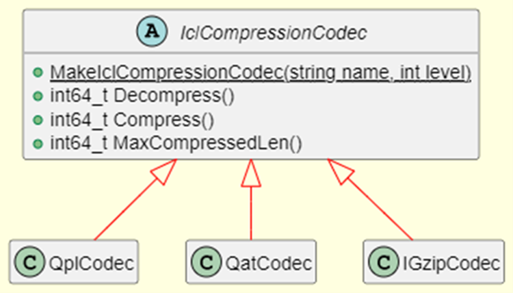

.. Copyright(c) 2022-2023 Intel Corporation.
..
.. Licensed to the Apache Software Foundation (ASF) under one
.. or more contributor license agreements.  See the NOTICE file
.. distributed with this work for additional information
.. regarding copyright ownership.  The ASF licenses this file
.. to you under the Apache License, Version 2.0 (the
.. "License"); you may not use this file except in compliance
.. with the License.  You may obtain a copy of the License at

..   http://www.apache.org/licenses/LICENSE-2.0

.. Unless required by applicable law or agreed to in writing,
.. software distributed under the License is distributed on an
.. "AS IS" BASIS, WITHOUT WARRANTIES OR CONDITIONS OF ANY
.. KIND, either express or implied.  See the License for the
.. specific language governing permissions and limitations
.. under the License.

.. _icl_user_guide_reference_link:

==============================
Intel Codec Library User Guide
==============================

.. _icl_description_reference_link:

Module description
******************

The Intel Codec Library (ICL) provides compression and decompression library for Apache Hadoop/Spark/Parquet/Arrow to make use of the hardware accelerator, and/or software for compression/decompression. It not only supports the use of Intel hardware accelerator such as QAT and IAA to accelerate the deflate-compatible data compression algorithm but also supports the use of Intel optimized software solutions such as ISA-L(Intel Intelligent Storage Acceleration Library) and IPP(Intel Integrated Performance Primitives Library) which utilize the latest CPU features (such as AVX-512) to accelerate the data compression.

Currently the Intel Codec Library supports the following backends:

- ``IGZIP`` - use ISA-L software to accelerate the compression  
- ``QAT`` - use QAT hardware accelerator to accelerate the compression
- ``QPL`` - use IAA hardware accelerator to accelerate the compression
- ``IPP`` - use IPP software to accelerate the compression. **Note:** Please refer `FAQ <https://www.intel.com/content/www/us/en/developer/articles/troubleshooting/oneapi-commercial-faq.html>`__ for IPP commercial products support.

Please check the table below to see which compression codecs are supported by each backend.

.. list-table::
   :widths: 40 30 30 
   :header-rows: 1

   * -
     - Deflate
     - LZ4
   * - IGZIP 
     - Y 
     - X 
   * - QAT 
     - Y 
     - Y 
   * - QPL 
     - Y 
     - X 
   * - IPP 
     - Y 
     - Y 

.. _icl_sdk_api_reference_link:

SDK API
*******

The class diagram of Intel Codec Library is shown below:

.. doxygenclass:: icl::codec::IclCompressionCodec
   :members:

Building the Library
********************

Prerequisites
=============

Before building Intel Codec Library, install and set up the following tools:

- nasm 2.14.0 or higher (e.g., can be obtained from https://www.nasm.us)

- A C++17-enabled compiler. GCC 8 and higher should be sufficient

- CMake version 3.16 or higher

Build
=====

To build Intel Codec Library, complete the following step:

1. Get the Source using the following command:

   .. code-block:: shell

      git clone --recursive https://github.com/intel/BDTK.git <BDTK>

2. Build the library by executing the following commands in ``<BDTK>``

   .. code-block:: shell

      mkdir build
      cd build
      cmake -DCMAKE_BUILD_TYPE=Release -DBDTK_ENABLE_ICL=ON -DBDTK_ENABLE_CIDER=OFF ../cpp
      cmake --build .

   .. note::

      You need to set more options to customize your build. See :ref:`icl_build_options_reference_link` for details.

.. _icl_build_options_reference_link:

Build Options
=============

By default, the C++ build system creates a fairly minimal build. Intel Codec Library supports the following build options which you can configure into build system by passing boolean flags to ``cmake``.

-  ``-DICL_WITH_IGZIP=[ON|OFF]`` - Build ICL with IGZIP backend (``ON`` by default).
-  ``-DICL_WITH_QAT=[ON|OFF]`` - Build ICL with QAT backend (``OFF`` by default).
-  ``-DICL_WITH_QPL=[ON|OFF]`` - Build ICL with QPL backend (``OFF`` by default).
-  ``-DICL_WITH_IPP=[ON|OFF]`` - Build ICL with IPP backend (``OFF`` by default).
-  ``-DICL_BUILD_TESTS=[ON|OFF]`` - Build the ICL googletest unit tests (``OFF`` by default).
-  ``-DICL_BUILD_BENCHMARKS=[ON|OFF]`` - Build the ICL micro benchmarks (``OFF`` by default).

Modular Build Target
====================

Since there are several suport backends of the ICL, we have provided modular Make target for building each supported backends, group of unit tests and benchmarks:

* ``make icl`` for ICL libraries which enable only *igzip* backend support.
* ``make icl-qat`` for ICL libraries which enable only *qat* backend support.
* ``make icl-qpl`` for ICL libraries which enable only *qpl* backend support.
* ``make icl-ipp`` for ICL libraries which enable only *ipp* backend support.
* ``make icl-all`` for ICL libraries which enable all supported backends.
* ``make icl-test`` for ICL libraries which enable unit tests for all supported backends.
* ``make icl-benchmark`` for ICL libraries which enable benchmark for all supported backends.

Additional requirements for QAT backend
=======================================

QAT backend is based on `QAT driver <https://www.intel.com/content/www/us/en/search.html?ws=idsa-default#q=quickassist&sort=relevancy&f:@tabfilter=[Downloads]>`__ and `QATzip library <https://github.com/intel/QATzip>`__. Please manually download QAT driver for your system and follow its README to build and install QAT driver. In addition to install the QAT driver you also need follow QATZip library README to manually build and install the QATZip library.

After installing the QAT driver and QATZip library, you need to do some confiugration on the QAT to enable QAT backend at run-time.

1. Enable huge page

   .. code-block:: shell

      echo 1024 > /sys/kernel/mm/hugepages/hugepages-2048kB/nr_hugepages
      rmmod usdm_drv
      insmod $ICP_ROOT/build/usdm_drv.ko max_huge_pages=1024 max_huge_pages_per_process=48

2. Update configuration files

   You need have the right QAT configuration files at the directory of ``/etc``. Please see `QAT Programmer's Guide <https://www.intel.com/content/www/us/en/content-details/743913/intel-quickassist-technology-intel-qat-software-for-linux-programmers-guide-hardware-version-2-0.html>`__  for how to configure QAT. We provide an example `configuration file <https://github.com/intel/BDTK/src/compression/resource/qat/4xxx_dev0.conf>`__ for your reference. This configuration file sets up to 4 processes that can bind to 1 QAT, and each process can use up to 16 QAT DC instances. Please modify this configuration file according to your requirements and copy the configuration file to directory of ``/etc/``.

3. Restart QAT driver

   .. code-block:: shell

      adf_ctrl restart

   You can check the QAT hardware status use the below command:

   .. code-block:: shell

      adf_ctrl status
   
   If all goes well, the output should be like:

   .. code-block:: shell

      There is 8 QAT acceleration device(s) in the system:
      qat_dev0 - type: 4xxx,  inst_id: 0,  node_id: 0,  bsf: 0000:6b:00.0,  #accel: 1 #engines: 9 state: up
      qat_dev1 - type: 4xxx,  inst_id: 1,  node_id: 1,  bsf: 0000:70:00.0,  #accel: 1 #engines: 9 state: up
      qat_dev2 - type: 4xxx,  inst_id: 2,  node_id: 2,  bsf: 0000:75:00.0,  #accel: 1 #engines: 9 state: up
      qat_dev3 - type: 4xxx,  inst_id: 3,  node_id: 3,  bsf: 0000:7a:00.0,  #accel: 1 #engines: 9 state: up
      qat_dev4 - type: 4xxx,  inst_id: 4,  node_id: 4,  bsf: 0000:e8:00.0,  #accel: 1 #engines: 9 state: up
      qat_dev5 - type: 4xxx,  inst_id: 5,  node_id: 5,  bsf: 0000:ed:00.0,  #accel: 1 #engines: 9 state: up
      qat_dev6 - type: 4xxx,  inst_id: 6,  node_id: 6,  bsf: 0000:f2:00.0,  #accel: 1 #engines: 9 state: up
      qat_dev7 - type: 4xxx,  inst_id: 7,  node_id: 7,  bsf: 0000:f7:00.0,  #accel: 1 #engines: 9 state: up

   .. note::
     * For non-root user, you nedd ``add Non-root user to qat group`` 

     .. code-block:: shell
     
      sudo usermod -g qat username # need to relogin
      or
      sudo newgrp qat  # effective immediately

     * The above additional requirements are not required when building the Intel Codec Library but only at runtime.

For more Intel® QuickAssist Technology resources go to `Intel® QuickAssist Technology (Intel® QAT) <https://developer.intel.com/quickassist>`__.

Additional requirements for QPL backend
=======================================

``libaccel-config`` library version 3.2 or higher is required for building Intel Codec Library with QPL support. Refer to `accel-config releases <https://github.com/intel/idxd-config/>`__ for how to install.

Additional requirements for IPP backend
=======================================

To be added

.. _icl_how_to_use_the_library_reference_link:

How to use Intel Codec Library
******************************

We provided several ways to use Intel Codec Library:

* ICL C++ API
* ICL JAVA API
* ICL `Arrow Compression Codec API <https://github.com/apache/arrow/blob/master/cpp/src/arrow/util/compression.h>`__  

ICL C++ API
===========

Intel Codec Library provides C++ API that the end users can directly call the C++ API to integrate into their own applications.

Let's walk through the below example that compresses and decompresses data with `igzip` backend with compression leve one to learn the basic workflow of Intel Codec Library C++ API.

.. code-block:: cpp

   #include "icl/icl.h"

   auto codec = IclCompressionCodec::MakeIclCompressionCodec("igzip", 1);

   int max_compressed_len =
      static_cast<int>(codec->MaxCompressedLen(data.size(), data.data()));

   std::vector<uint8_t> compressed(max_compressed_len);
   std::vector<uint8_t> decompressed(data.size());

   int64_t actual_size =
      codec->Compress(data.size(), data.data(), max_compressed_len, compressed.data());
   compressed.resize(actual_size);

   int64_t actual_decompressed_size = codec->Decompress(
      compressed.size(), compressed.data(), decompressed.size(), decompressed.data());

To work with Intel Codec Library C++ API, the application will need to:

1. The application only needs to include one header file ``icl/icl.h``, which specifies the prototypes of all the functions. 
2. Call `IclCompressionCodec::MakeIclCompressionCodec()` to create the instance of IclCompressionCodec, you can pass the required underlying codec and the compression level as parameters to this function. 
3. Call `MaxCompressedLen()` to query the required compressed buffer size
4. Allocate compressed buffer according to the returned value of step 3. 
5. Call `Compress()` to perform a compression operation for the input data buffer and return the actual compressed size.
6. Or call `Decompress()` to perform a decompression operation. 
7. Free resources.

ICL JAVA API
============

To Be Added.

.. _icl_arrow_reference_link:

ICL Arrow Compression Codec API
===============================

We also provides an Arrow patch that enable the Arrow Compression Codec to leverage the Intel Codec Library to accelerate the Arrow GzipCodec. Softwares(e.g., the native parquet reader, the Arrow IPC, the Arrow Flight etc.) that use Arrow Compression Codec can get performance boost without any code modify and simply replacing the Arrow library.   

To use Arrow Compression Codec with Intel Codec Library, users need rebuild Arrow following the below guide:

1. Build Intel Codec Library using the following command:

   .. code-block:: shell

     make icl 

   .. note::

     * Please see :ref:`icl_building_the_library_reference_link` for how to customize your build and enable required codec. 
     * Please make sure to turn off the option ``-DICL_BUILD_TESTS=OFF`` and ``-DICL_BUILD_BENCHMARKS=OFF`` when build 
2. Download the Arrow patch `here <https://github.com/intel/BDTK/src/compression/build-support/0001-Add-ICL-support.patch>`__.
3. Get the Arrow Source using the following command:

   .. code-block:: shell

      git clone -b apache-arrow-10.0.0 https://github.com/apache/arrow.git

   .. note::

     Currently, we only provide the patch for Arrow version *10.0.0*, other versions please make corresponding modifications based on this patch.
4. Apply the patch using the following command: 

   .. code-block:: shell

      cd arrow
      git am 0001-Add-ICL-support.patch
5. Build Arrow with ``-DARROW_WITH_ICL=ON`` option

   .. note::

      * Please ref `here <https://arrow.apache.org/docs/developers/cpp/building.html>`__ for how to build arrow.
6. Set the environment ``GZIP_BACKEND`` to enable Intel Codec Library, for example, to enable ``igzip`` backend, you can set ``GZIP_BACKEND`` with the following command:

   .. code-block:: shell

     export GZIP_BACKEND="igzip" 

   .. note::

     * The supported ``GZIP_BACKEND`` can be set  to one of ``igzip``, ``qat``, ``qpl``, or ``ipp``
     * The Arrow Codec must be set to ``Compression::GZIP`` 
7. Use Arrow Codec API as below example:

 .. code-block:: cpp

   #include "arrow/util/compression.h"

   ARROW_ASSIGN_OR_RAISE(auto codec, Codec::Create(Compression::GZIP, 1));

   std::vector<uint8_t> compressed(max_compressed_len);
   std::vector<uint8_t> decompressed(data.size());
   int max_compressed_len =
      static_cast<int>(codec->MaxCompressedLen(data.size(), data.data()));

   ARROW_ASSIGN_OR_RAISE(
      auto compressed_size,
      codec->Compress(data.size(), data.data(), max_compressed_len, compressed_data.data()));

   ARROW_ASSIGN_OR_RAISE(
      auto decompressed_size,
      codec->Decompress(compressed.size(), compressed.data(), decompressed.size(), decompressed.data()));

How to run benchmark
********************

Intel Codec Library provided two types of benchmarks: 

* Benchmark for normal file  
* Benchmark for Parquet file 

Benchmark for normal file
=========================

This benchmark will read ``Calgary corpus`` data which commonly used for comparing data compression algorithms as input and use different compressors supported by Arrow to compress and decompress that data to benchmark different codec's performance.

To run the benchmark following the below guide:

1. Build Intel Codec Library with benchmark option on:  

   .. code-block:: shell

      mkdir build
      cd build
      cmake -DCMAKE_BUILD_TYPE=Release -DBDTK_ENABLE_ICL=ON -DICL_BUILD_BENCHMARKS=ON -DBDTK_ENABLE_CIDER=OFF ../cpp
      cmake --build .

   .. note::

     * To build benchmark, you need build Arrow with ICL patch first, please see :ref:`icl_arrow_reference_link` for how to build Arrow. 
     * Please see :ref:`icl_building_the_library_reference_link` for how to customize your build and enable required backend. 
     * Please make sure to turn on the option ``-DICL_BUILD_BENCHMARKS=ON`` when build 
     * Please make sure build ICL with the correct Arrow package which build with ICL patch, you can set the environment ``ARROW_HOME`` to the folder where installed the Arrow with ICL patch.
2. Prepare the ``Calgary corpus`` data for benchmark
   You can download the data from `here <http://www.data-compression.info/files/corpora/largecalgarycorpus.zip>`__, then unzip it and tar these files to a tar file ``calgary.tar``

   .. code-block:: shell

      unzip largecalgarycorpus.zip -d calgary
      tar cvf calgary.tar calgary

3. Copy the calgary.tar to folder where you run the CompressionBenchmark which generated in step 1.

   .. note::

     * To enable ICL, you need set the environment ``GZIP_BACKEND`` when run the benchmark. 

Benchmark for parquet file
==========================

We use TPC-H lineitem table as the source to benchmark the parquet reader performance by reading all the columns in this table. Please follow the below steps to generate the Parquet file for TPC-H lineitem table and run the benchmark.

1. Build Intel Codec Library with benchmark option on:  

   .. code-block:: shell

      mkdir build
      cd build
      cmake -DCMAKE_BUILD_TYPE=Release -DBDTK_ENABLE_ICL=ON -DICL_BUILD_BENCHMARKS=ON -DBDTK_ENABLE_CIDER=OFF ../cpp
      cmake --build .

   .. note::

     * To build benchmark, you need build Arrow with ICL patch first, please see :ref:`icl_arrow_reference_link` for how to build Arrow. 
     * Please see :ref:`icl_building_the_library_reference_link` for how to customize your build and enable required backend. 
     * Please make sure to turn on the option ``-DICL_BUILD_BENCHMARKS=ON`` when build 
     * Please make sure build ICL with the correct Arrow package which build with ICL patch, you can set the environment ``ARROW_HOME`` to the folder where installed the Arrow with ICL patch.

2. Generate the Parquet file for TPC-H lineitem using the ``TpchDataGen`` tool, in your ``build`` directory, run the following command will generate parquet file ``lineitem.igzip.parquet`` with ``igzip`` backend with compression level one at TPC-H SF1. 

   .. code-block:: shell

     ./TpchDataGen -s 1 -c 'igzip' -l 1 -f lineitem.igzip.parquet

   .. note::

     * You can specify the backend use ``-c`` parameter, ``-f`` to specify the name for parquet file, ``-l`` to specify the compression level and ``-s`` to specify the scale factor for TPCH datagen.

3. Run the bechmark using the ``ParquetBenchmark`` tool. As a example, the following command will benchmark ``igzip`` backend for single thread which will run 10 iterations.

   .. code-block:: shell

     ./ParquetBenchmark -c 'igzip' -f lineitem.igzip.parquet -i 10 -t 1

   .. note::

     * You can specify the backend use ``-c`` parameter, ``-f`` to specify the name for parquet file, ``-i`` to specify the iterations and ``-t`` to specify the threads run the benchmark. 
     * Please make sure that the file specified by ``-f`` is generated by ``-c`` backend in step 2.

Limitation
**********

In order to take full advantage of hardware acceleration, Intel Codec Library only supports block-based interface for compression, aka “one shot”, so the data compressed by ICL can’t be decompressed by stream-based software like Gzip. 

To Be Add
*********
